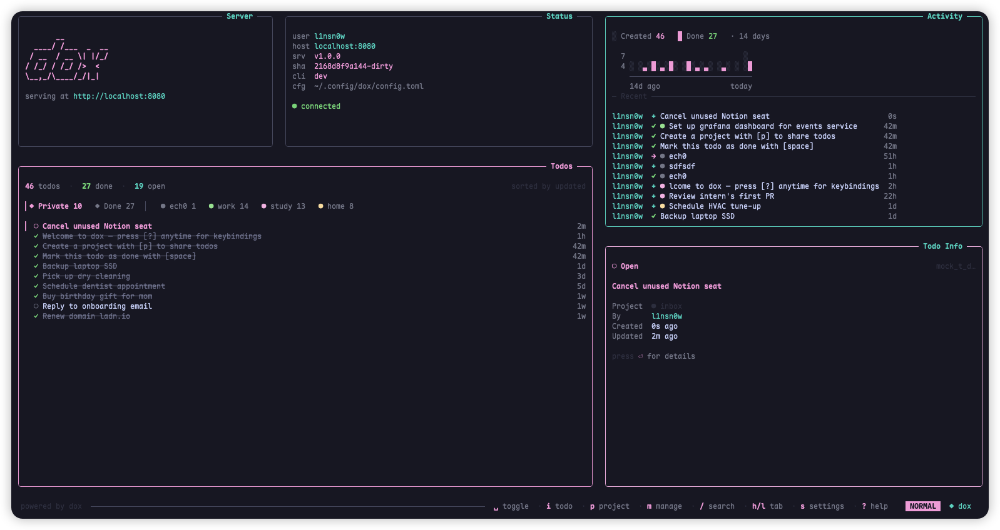

# dox

A self-hosted todo — for one person, or a few.

A single Go binary on your server, a thin TUI client on your laptop. The
server holds every byte of truth; the client never caches. Whoever registers
first becomes the owner and decides who else gets in.



> **Heads up:** dox is in early, active development — things will move and
> occasionally break between versions. Issues and pull requests warmly
> welcome at [github.com/lin-snow/dox](https://github.com/lin-snow/dox).

## Deploy

The server is one container. One command, one persistent volume:

```bash
docker run -d --name dox \
  -p 8080:8080 \
  -v /opt/dox/data:/app/data \
  sn0wl1n/dox:latest
```

Or with `compose.yml`:

```yaml
services:
  dox:
    image: sn0wl1n/dox:latest
    ports: ["8080:8080"]
    volumes: ["./data:/app/data"]
    restart: unless-stopped
```

## Use

Run `dox`. The TUI handles onboarding (register · login · accept invite) and
everything after.

## Stack

- **Server** — Go · grpc-gateway · sqlc · goose · SQLite
- **Client** — TypeScript · Ink · Bun
- **Contract** — `proto/dox/v1/` (auth, user, project, invite, todo)

IDs are ULID, timestamps are `int64` unix milliseconds, and only two routes
are public: `/v1/auth/register` and `/v1/auth/redeem`. Everything else needs
a device bearer token.

## Develop

```bash
just gen            # proto → Go + TS, sqlc → Go DB bindings
just serve          # run the server locally
just cli -- list    # run the CLI against the local server
just release v0.1.0 # tag + push → triggers Docker Hub release
```

See [`docs/onboarding.md`](docs/onboarding.md) for how the auth/onboarding
flow actually works.

## License

[AGPL-3.0](LICENSE)
